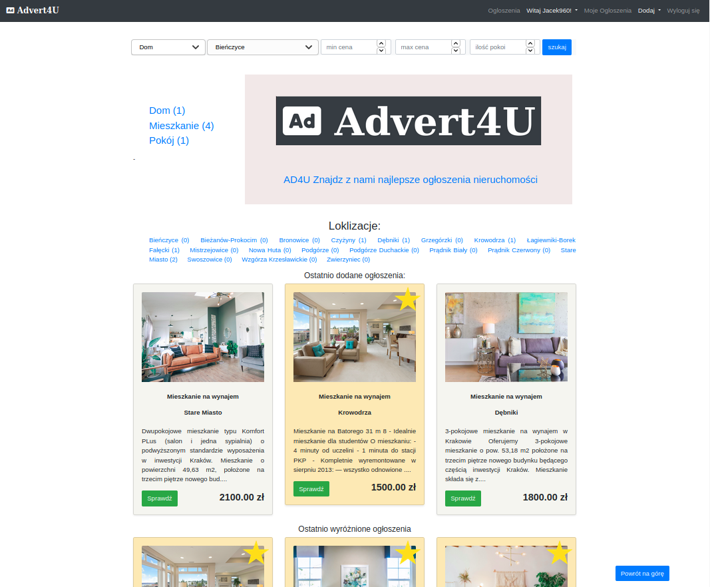
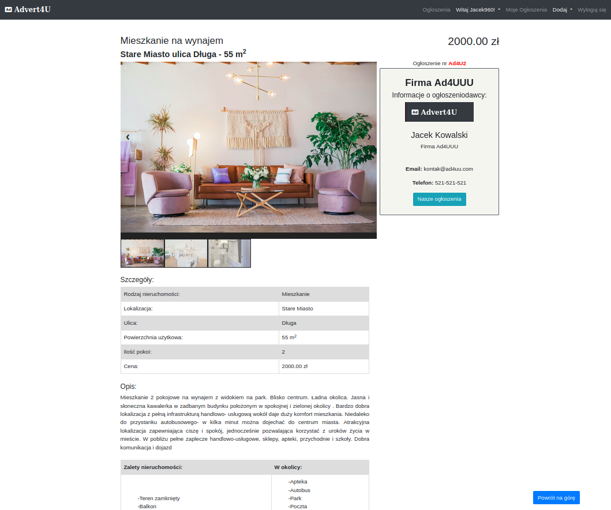
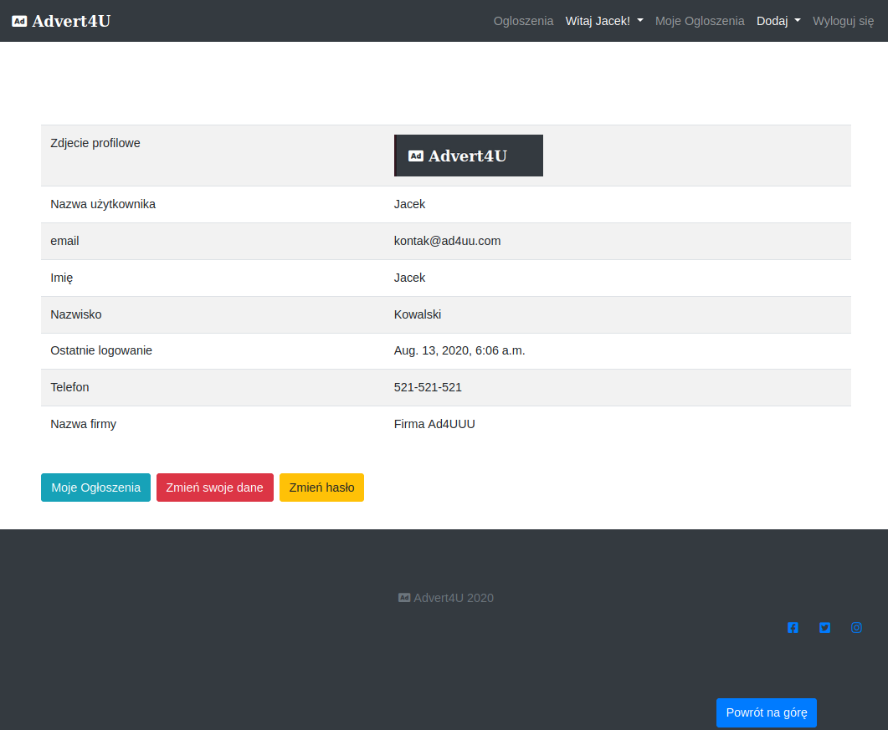
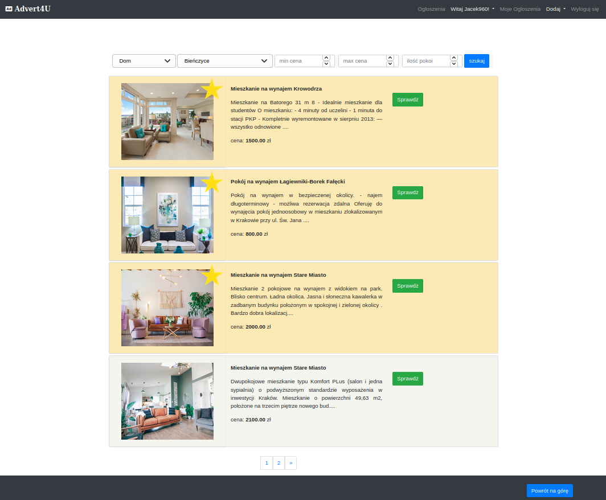

# Property Advertising Website
> Websites for Advertising Your Property Rental Listing

## Table of contents
* [General info](#general-info)
* [Screenshots](#screenshots)
* [Technologies](#technologies)
* [Setup](#setup)
* [Features](#features)
* [Status](#status)
* [Credits](#credits)
* [Contact](#contact)

## General info
Websites for Advertising Property Rental Listing

## Screenshots
Home Page

Advert Page

Dashbord

All Adverts and search Page

## Technologies
* Django 3.1
* Python 3.8
* Bootstrap 4

## Setup
Use pip installation to install dependencies from requirements.txt
## Code requirements.txt

`$ pip install -r requirements.txt`

## Features
To-do list:
* Contact advertiser form
* jQuery - Ajax - search banner

## Status
Project is: _in progress_, More to be add

## Credits
Photos for project used from [Unsplash](https://unsplash.com/) Thank you all!

## Contact
Created by [Jacek960](mailto:j.kuciel@outlook.com)- feel free to contact me!

